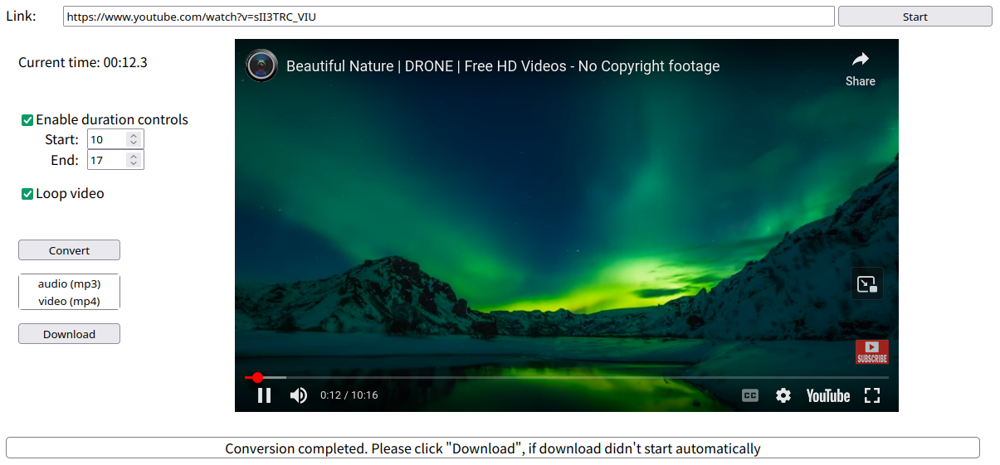

# AudioVideoConverter
A simple self-hosted YT Audio/Video converter with Docker support.

It allows you to crop video from Youtube within specified intervals and convert it to MP3 or MP4 format.



## Prerequisites
In order to use this application, you need to have the following prerequisites installed:
- [npm](https://www.npmjs.com/): Install dependencies from package.json
- [node.js](https://nodejs.org/): Run the application locally
- [yt-dlp](https://github.com/yt-dlp/yt-dlp): Download video in different formats from Youtube
- [ffmpeg](https://www.ffmpeg.org/): Crop the video and convert it from one format to another if necessary

Or alternatively, use docker to build an image.

## Run locally
Run the application by following these steps:

- Install dependencies:
```bash
npm install
```

- Start the server:
```bash
node AudioVideoConverterServer.js
```

Now server is running successfully and you can reach it by accessing it via http://localhost:8080/.

## Run with Docker
- Build the Docker image:
```bash
docker build -t audiovideoconverter:latest .
```

- Start the Docker container:
```bash
docker run --rm --name=audiovideoconverter -d -p 8080:8080 audiovideoconverter
```

If you followed the above steps on your OS, the server should be accessible via the same path as in step [Run locally](#run-locally).

## Known issues
- Youtube player does not start with the similar error to: "This video is unavailable". If you start the server in docker container or connect to it remotely, the cause may be that origin differs (CORS), especially when you make requests using IP addresses. Try adding local DNS entry for server (in "/etc/hosts" on Linux/macOS or in "C:\Windows\System32\Drivers\etc\hosts" on Windows) and connect to server via domain name instead.
- yt-dlp fails to download some video or audio format. The most likely cause of this issue is using outdated version of yt-dlp. Please update using ```yt-dlp -vU``` command or download the latest version from https://github.com/yt-dlp/yt-dlp#release-files for your OS.
- The duration of cropped video or audio file differs by several milliseconds. There are a lot of different formats, which in turn have multiple streams that are starting and stopping at different times, therefore what ffmpeg is converting may differ from what is displayed on the player. You can try manually changing the starttime or endtime of the video by a few milliseconds (even several digits after decimal point) if you need high precision duration.
